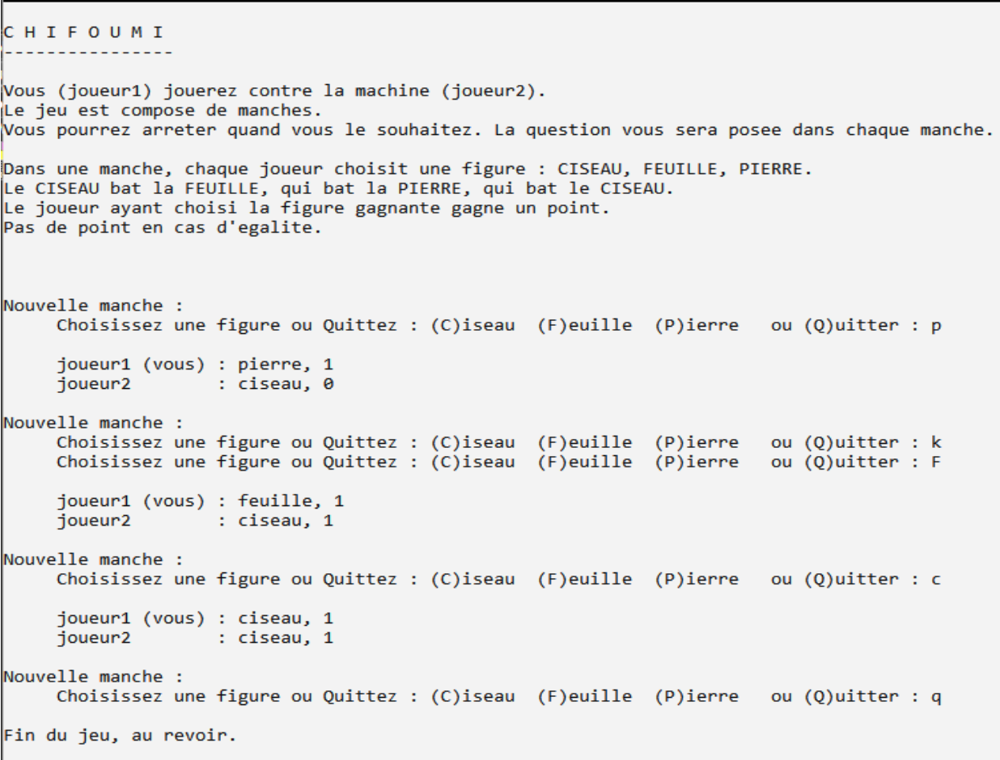

<div align="center">
    <h2>ChiFouMi</h2>
</div>

### 1. Description du jeu 
> Jeu également connu sous le nom de « feuille-pierre-ciseau » se jouant à deux joueurs.  
> Le  jeu  est  composé  de  manches.  Lors  d’une  manche,  chaque  joueur  choisit  une  figure :  CISEAU,  FEUILLE, PIERRE. 
> Le CISEAU bat la FEUILLE, qui bat la PIERRE, qui bat le CISEAU. 
> Le joueur ayant choisi la figure gagnante voit son score incrémenté de 1 point. Il n’y a pas de point lorsque les figures jouées sont égales. 
>Le jeu peut prévoir un nombre maximum de points à atteindre pour désigner le vainqueur.  

### 2. Spécification du besoin 
>Adaptation du jeu pour le programme à réaliser 
>> Un joueur humain joue contre la machine.
> 
>Lors d’une manche, chaque joueur choisit une figure : CISEAU, FEUILLE, PIERRE : 
>> Le joueur humain choisit la figure en saisissant son choix,  
>> Le joueur machine choisit sa figure de manière aléatoire. 
>
>A la fin de la manche, le jeu peut s’arrêter sur demande du joueur humain. Il n’y a pas de gagnant. 
>On demande d’afficher 
>> Les règles du jeu avant de commencer le jeu 
>> Le score de chaque joueur à la fin de chaque manche 
>> Un message de fin de jeu  

#### Exemples de comportements possibles

#### Version 1 : ChifoumiV1.cpp

#### Version 2 : ChifoumiV2.cpp


### 3. Ressources à disposition 
> Utiliser la fonction int `randomMinMax()` à inclure dans votre fichier main.cpp de la manière suivante :

###### Déclaration
```cpp
int randomMinMax(int min, int max);
```

###### Définition
```cpp
int randomMinMax (int min, int max){
    return rand()%(max-min) + min;
}
```

###### Exemple d'appel
```cpp
nbreAleatoire = randomMinMax (1,4);
```

### 4. Extensions possibles : ChifoumiManches.cpp
> Le nombre de manches peut éventuellement être fourni par le joueur.  
> Dans ce cas : 
>> - le joueur humain ne peut plus arrêter le jeu quand il le souhaite, 
>> - le programme désignera le vainqueur une fois toutes les manches jouées,
>> - le numéro de chaque manche / nombre total de manches seront affichés. 